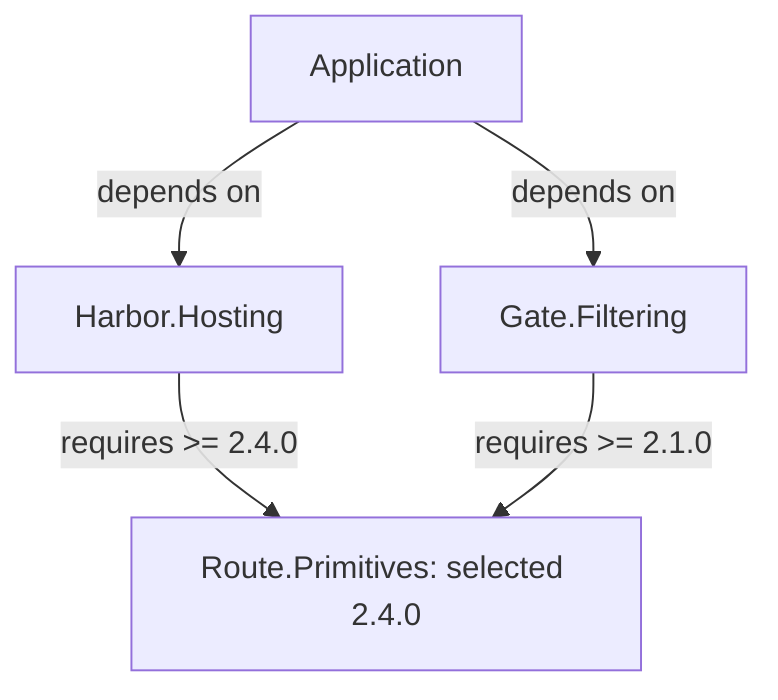
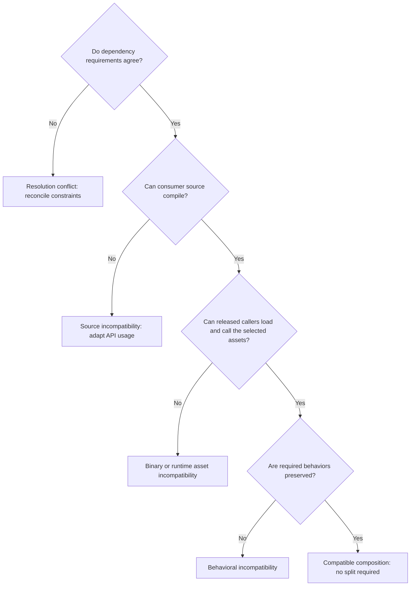
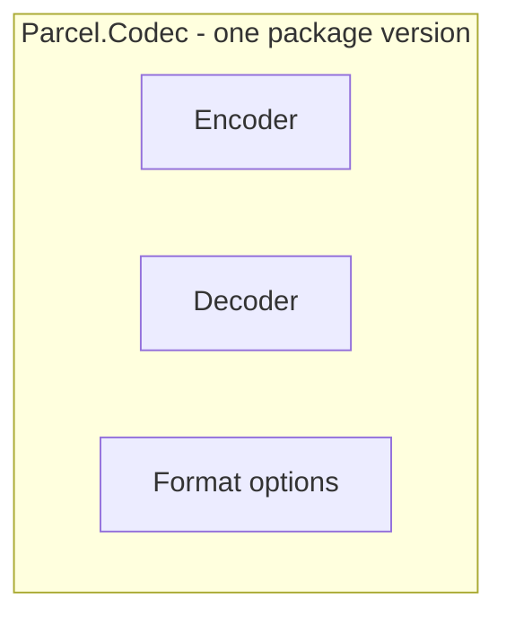
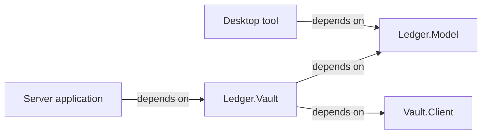

# Choosing package boundaries

A NuGet package determines what consumers adopt, resolve, and upgrade together. Good boundaries preserve coherent behavior while allowing useful independence. Excessive breadth and unnecessary fragmentation both impose recurring costs on consumers and maintainers.

Use this guide when adding functionality, proposing an extraction, or reconsidering an existing package. Aim for a supportable compatibility and distribution contract, not a particular package count or topology.

## What each boundary controls

| Boundary | What it separates | What it does not establish |
| --- | --- | --- |
| Repository | Source history, access, collaboration, and automation | Independent package versions or runtime isolation |
| Project | Build configuration, references, and compilation inputs; a class-library project normally produces an assembly | A requirement to publish a package |
| Assembly | Compiled types, identity, references, and an access boundary for `internal` members | Independent installation or NuGet version selection |
| Namespace | Names and API organization | Encapsulation, deployment, or dependency isolation |
| NuGet package | A distribution identity and version, assets, and declared dependencies | A process boundary or private runtime copy of each dependency |

A package can contain multiple assemblies and framework-specific assets, or only dependencies. Several packages can live in one repository and release independently; separate repositories can still produce tightly coupled packages.

Internal modules need not become public packages. Extracting an implementation detail may turn an easily changed internal agreement into a supported public contract. Conversely, separate namespaces do not let consumers upgrade functionality independently.

Code reuse asks whether implementations should be shared. Independent versioning asks whether consumers benefit from choosing and updating them separately. Neither answer determines the other.

## How shared dependencies behave

The following describes ordinary `PackageReference` restore. A direct dependency is declared by the consuming project; a transitive dependency is reached through another package. All reachable dependencies form its dependency closure.

NuGet selects one version per package ID in each target framework's resolved graph, not a private version for each caller. With ordinary non-floating constraints, it prefers the lowest applicable version; cousin dependency paths are reconciled against their requirements. Floating references select the highest matching version. Direct-dependency-wins can override a transitive requirement, including causing a downgrade diagnostic. Restore therefore is not simply "highest version wins." See [NuGet dependency resolution](https://learn.microsoft.com/en-us/nuget/concepts/dependency-resolution).

### A diamond means two paths to the same package

A **dependency diamond** occurs when two branches from one consumer meet at a shared dependency. Here, the application chooses two packages directly, and both require `Route.Primitives` transitively. The bottom node is one package identity reached twice, not two isolated installations.

In dependency diagrams, arrows point from a consumer toward the package it depends on. Labels state dependency requirements. Other visuals below explicitly identify containment or diagnostic flow instead.



Assuming those releases are available, no other constraints, and no floating versions or overrides, the shared version is 2.4.0. If one path instead requires `< 2.4.0`, these cousin requirements conflict. A direct override may change resolution, but cannot establish compatibility.

This is not a dependency cycle: no path leads back to its starting package. The important property is **version convergence**: both branches must work with the selected version. The graph alone does not justify restructuring:

- **Harmless convergence:** 2.4.0 preserves the APIs and behavior both callers require. Sharing its implementation and fixes is useful; the diamond needs no architectural repair.
- **Binary incompatibility:** 2.4.0 removes a method used by an already compiled `Gate.Filtering`. The application may compile successfully while that call fails at runtime.
- **Behavioral incompatibility:** the method still exists, but address normalization changes in a way that invalidates filtering rules. API checks alone will not detect the problem.

Updating `Harbor.Hosting` can thus change a dependency used by an unchanged `Gate.Filtering`. First identify the broken contract. Repairing compatibility or updating a caller may be better than extracting packages. Separation helps only when the conflicting needs can actually become independent.

A plain `Version="2.1.0"` normally allows 2.1.0 and higher, including later majors; `[2.1.0]` requires exactly that version. Restrictive ranges can express known incompatibility but make composition harder. Avoid exact pins or upper bounds as a substitute for compatibility work. Small internal helpers can sometimes use private source reuse instead of a runtime dependency, but each compiled copy then needs servicing. See [.NET library dependency guidance](https://learn.microsoft.com/en-us/dotnet/standard/library-guidance/dependencies).

## Compatibility extends beyond restore

Distinguish three questions: can existing source compile, can previously compiled callers run, and does observable behavior still meet their expectations? Configuration defaults, persisted formats, exceptions, lifecycle rules, and security behavior matter even when signatures remain unchanged.

### Locate the failure before changing the boundary

The same diamond can work correctly, fail during restore, or fail only when an application runs. This diagnostic flow separates those outcomes. Arrows mean "continue this check," not package dependencies; the checks summarize distinct obligations rather than a literal build pipeline.



Agreeing ranges do not guarantee that suitable assets exist for the target platform. Conversely, forcing a version past a constraint warning does not make callers compatible. A successful build only answers part of the question, especially when dependencies arrive as already compiled binaries. Use the failing obligation to choose a remedy; a new package identity is useful only if it removes the underlying conflict.

The NuGet package version selects a distributed release. `AssemblyVersion` participates in runtime assembly binding; file and informational versions serve identification purposes. These numbers are distinct. Semantic Versioning communicates change intent but does not enforce compatibility or isolate major versions. On .NET Framework, strong-named assembly version changes may require binding redirects; redirects do not restore removed APIs. See [.NET versioning guidance](https://learn.microsoft.com/en-us/dotnet/standard/library-guidance/versioning).

Package validation and API compatibility checks can detect binary API breaks against a released baseline and inconsistencies across compatible target frameworks. Dependencies and framework support also belong to the package contract. Removing a dependency or moving public types to another assembly can affect existing consumers even if their source appears unchanged. See [.NET package compatibility rules](https://learn.microsoft.com/en-us/dotnet/standard/library-guidance/nuget-package-compatibility-rules).

Plan verification using packed artifacts, previously compiled callers, supported framework/runtime combinations, and representative dependency combinations. Include behavioral tests for shared invariants. Rebuilding every project together can hide incompatibility with released binaries. Package validation is evidence, not proof of complete behavioral compatibility.

## Recognize the underlying problem

Package structure is a means of controlling obligations. Identify which obligation is causing friction before deciding whether to split or combine code.

| Pattern | What consumers experience | What to investigate |
| --- | --- | --- |
| Shared dependency / diamond | Updating one branch changes the shared implementation used by another. | Whether both callers remain compatible; the diamond itself is ordinary reuse. |
| Excessive dependency breadth | A small feature brings an SDK, platform restriction, or servicing burden. | Whether an optional boundary would actually remove it from those consumers' dependency closure. |
| Cascading upgrades | A dependency change requires caller releases, then application updates, even for a small fix. | Whether public contracts truly require coordinated changes or unnecessarily strict version policies create the chain. |
| Unnecessary fragmentation | One operation requires several package choices, registrations, and version combinations. | Whether the parts have independent consumers or are one compatibility unit split into extra identities. |
| Exposed implementation details | An internal refactor becomes a breaking change for another package. | Whether the boundary made private coordination public without a useful stable contract. |

A release chain is not automatically a defect: a genuinely breaking shared contract requires coordination. It becomes avoidable friction when supposedly independent packages cannot change independently, or harmless dependency updates require unnecessary downstream releases. Likewise, a broad package is not automatically burdensome if its consumers need the whole unit and its dependencies remain suitable.

## Weigh both directions

Start with actual or credible consumers and concrete changes. Each signal has a counterargument; none is a scoring rule.

| Evidence | Reason to keep functionality together | Reason to separate it |
| --- | --- | --- |
| Public concepts and invariants | One coherent operation or shared format benefits from an atomic package update; internal coordination stays private. | Independently useful contracts may evolve through a stable protocol without sharing a release. |
| Consumer groups | Parts normally installed and used together benefit from one discoverable entry point. | Distinct groups should not repeatedly absorb dependencies, migration work, or support changes for unused features. |
| Change and release patterns | Frequent coordinated changes make separate compatibility promises and release chains expensive. | Different reasons for change can justify independent adoption, support windows, and urgent fixes. Check whether lockstep releases are merely policy. |
| Dependency closure | A common, modest dependency set leaves little practical benefit from extraction. | Optional SDKs, native assets, platform restrictions, licensing constraints, or security-sensitive dependencies can burden unrelated consumers. |
| Contract ownership | Exposing internals or inventing interfaces adds obligations without useful independence. | A contract with independent consumers and an owner capable of maintaining it can outlive particular implementations. |
| Operations and support | Shared testing, publishing, documentation, and support can make one package sustainable. | Repeated consumer upgrade friction or delayed releases may outweigh that saving; shared automation can support multiple packages. |

Treat correctness, platform constraints, and essential consumer requirements as stronger evidence than naming or an attractive diagram. Consumer independence matters only when APIs, dependencies, and support policy permit it. Operational capacity matters because unsupported independence is not a usable product.

Different release cadences are a signal, not a verdict: an infrequently changed feature may coexist harmlessly with a frequently updated one. Publishing a release does not itself force every application to upgrade. Conversely, one version can require consumers to accept an unrelated breaking change to obtain a needed fix. Evaluate actual upgrade paths.

An unused feature's dependency may still require restoration, inventory, or servicing, without necessarily being loaded or exploitable at runtime. Asset flow and deployment affect the cost. Separation only reduces that cost for consumers whose dependency closure actually excludes the feature.

## Examples with different outcomes

### Keep a coherent compatibility unit together

`Parcel.Codec` provides an encoder, decoder, and format options. Applications commonly use them together, and changes must preserve the same framing, checksums, and interpretation of options.

The box below is one published package; the inner boxes are implementation responsibilities, not separate NuGet identities. Containment means "ships together." There are no dependency arrows in this visual.



One package delivers a consistent implementation in one update. Separate encoder, decoder, and options packages would expose coordination details and create combinations that someone must support. Internal modules can still keep the implementation understandable.

The opposing case strengthens if credible consumers need a lightweight reader without the writer's substantial dependencies, or need different platform support. A stable file-format specification could support separate packages. Shared invariants justify cohesion only while satisfying them together is more useful than supporting them across a contract.

### Separate optional integration

`Ledger.Model` represents ledger entries for desktop tools, command-line programs, and servers. Some applications persist those entries using the independently useful `Vault.Client`, which brings a remote-service SDK and its servicing requirements.

Two consumer paths make the benefit visible. The desktop tool selects only the model; the server selects the integration and therefore accepts both underlying packages. All arrows are required dependencies once that path is selected. "Optional" describes the application's choice of integration, not an optional dependency inside `Ledger.Vault`.



`Ledger.Vault` owns the mapping and persistence integration. Applications using only `Ledger.Model` avoid the SDK dependency; integration consumers accept both dependencies. Service-related changes can be released without changing the model package, provided their contract remains compatible.

Putting the integration into `Ledger.Model` would simplify installation and coordinated support. Separation is stronger here because a real consumer group gains a smaller dependency closure and a different upgrade path. If every supported consumer requires the integration and both APIs constantly change together, that advantage may disappear. The bridge still owns testing and documentation of supported combinations.

### A foundation can centralize a contract or relocate coupling

Two packages need shared types:

```text
Application --> Flow.Engine --> Flow.Core
           +--> Flow.Tools  --> Flow.Core
```

`Flow.Core` is useful if it owns a stable workflow description that tools produce and engines execute. Its independent consumers and semantic contract justify a shared version boundary.

If it instead collects unrelated persistence, logging, and scheduling internals, both callers still converge on one version of that collection. Moving code there has relocated coupling. Examine which changes each consumer must accept and which contracts become public. Names such as `Core`, `Common`, `Shared`, `Infrastructure`, or `Abstractions` supply no evidence either way.

### Practical comparisons, not templates to copy

Noda Time keeps date/time functionality in its main package while offering Json.NET serialization separately, with the serializer dependency attached to that integration. This enables selective dependency adoption; consumers must also discover and configure the integration. See [Noda Time's installation guide](https://nodatime.org/userguide/installation).

In the other direction, AutoMapper 13 folded dependency-injection support into its main package and deprecated the separate integration package. See [the maintainer's release announcement](https://www.jimmybogard.com/automapper-13-0-released/). The practical trade-off is one fewer package choice and version relationship, at the cost of making that integration part of the main package's obligations. This trade-off is an inference from the structure, not a claim about the maintainer's motives.

Neither example establishes the right boundary for another library. Compare consumer needs and dependency costs directly.

## Intermediate options

Choose the least costly structure that meets the demonstrated need, including options without independent packages.

| Option | Useful when | Main limitation |
| --- | --- | --- |
| Widen an existing package | Functionality belongs to its public concept, invariants, and consumer expectations. | Convenience can conceal growing obligations for unrelated consumers. |
| Publish an independent package | It has useful consumers, a supportable contract, and meaningful adoption or upgrade freedom. | Discovery, releases, documentation, and compatibility combinations become recurring work. |
| Extract contracts | Consumers exchange shared types or implement a stable extension protocol without needing the implementation. | Contracts need compatibility ownership; interfaces invented solely to remove an edge add indirection. |
| Add an integration package | Independently useful packages need an optional adapter. | The adapter owns compatibility with both sides and can become a release bottleneck. |
| Offer an aggregate package | Consumers often install the same family and want a convenient entry point. | It adds dependencies and maintenance; it neither isolates versions nor removes convergence. |
| Keep a small implementation local or share source privately | A helper is internal, modest, and cheaper to maintain than a public contract. | Copies can drift; fixes must reach each built consumer. Shared source types compiled into different assemblies do not form a common public type identity. |
| Use multiple assemblies in one package | Separate compilation or access boundaries help, but consumers need one distribution unit. | Packaging needs deliberate handling; assemblies cannot be upgraded separately through that package. |
| Keep packages in one repository or separate repositories | Shared coordination or independent access and ownership fit operational needs. | Repository separation cannot repair unstable contracts and adds coordination cost. |

For example, `Ledger.Bundle` could depend on `Ledger.Model` and `Ledger.Vault`. Common consumers get one installation choice while direct users of `Ledger.Model` retain a lighter graph. Its tested dependency set is useful guidance, not an atomic guarantee for the application: other references still participate in resolution.

Microsoft recommends one assembly per package to simplify ownership and asset selection. Treat that as packaging advice, not proof that each assembly deserves an independent public lifecycle. Multiple assemblies in one package are possible but require explicit packaging; ordinary project references are emitted as package dependencies rather than automatically bundled. Do not distribute competing copies of the same shared assembly through different package IDs to evade convergence. See [NuGet assembly packaging guidance](https://learn.microsoft.com/en-us/nuget/create-packages/select-assemblies-referenced-by-projects).

## Make and record the decision

1. **Describe the consumer problem.** Identify public operations, consumer groups, shared invariants, dependency closure, and a representative upgrade motivating change. Separate observed needs from hypothetical reuse.
2. **Compare credible alternatives.** Include keeping or widening the package, separating it, and useful intermediate options. State the strongest objection to each preferred direction.
3. **Walk through both counterfactuals.** What becomes worse if the parts remain together? What becomes worse if they split? Include a feature release, a breaking change, and an urgent dependency fix. Who pays each cost: consumers, maintainers, or both? Is it migration work or recurring release work?
4. **Check independence and cohesion.** Can one part be consumed and upgraded without the other? Can supported combinations be explained and tested? Would a split require lockstep upgrades, public internals, or artificial abstractions? Would staying together preserve meaningful invariants or only administrative convenience?
5. **Define compatibility and migration.** Assign contract ownership, supported combinations, framework support, and verification responsibilities. Account for existing package IDs, public type identity, downstream dependencies, and migration documentation; extraction after publication is not simply moving files.
6. **Record a decision and revisit trigger.** State the boundary, benefits, accepted costs, uncertain assumptions, and evidence that would change the decision. Avoid package-count targets or arbitrary thresholds.

When evidence is inconclusive, prefer the least disruptive viable choice: retain an existing boundary, or keep new closely related functionality internally structured in its coherent package. Public identities and contracts create lasting support and migration obligations. This is a provisional default, not permission to accumulate unrelated functionality. Override it for credible independent consumers, material optional dependency or platform constraints, incompatible support needs, or repeated upgrade friction. Extraction is not free later, so revisit before dependent public APIs spread.

### Warning signs to revisit

**Possible premature splitting:** consumers must discover several packages for one operation; changes trigger cascading version bumps; meaningful tests always require the entire family; public interfaces mirror implementation details; independent consumers cannot be identified.

**Possible excessive breadth:** unrelated users repeatedly inherit dependency or platform changes; one area blocks another's urgent fix; independent groups need incompatible support windows; unrelated APIs dominate release notes and upgrade reviews; teams cannot explain a shared behavioral contract.

Before accepting a proposal, confirm that it explains consumer benefit, the strongest alternative, compatibility ownership, recurring costs, migration consequences, and a concrete revisit trigger. Explicit trade-offs can justify one package, several packages, or an intermediate structure.
